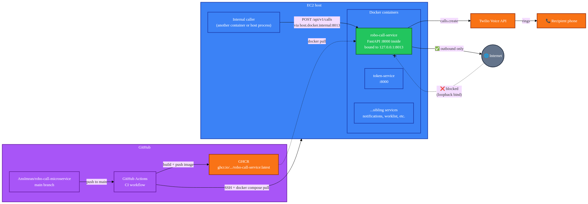
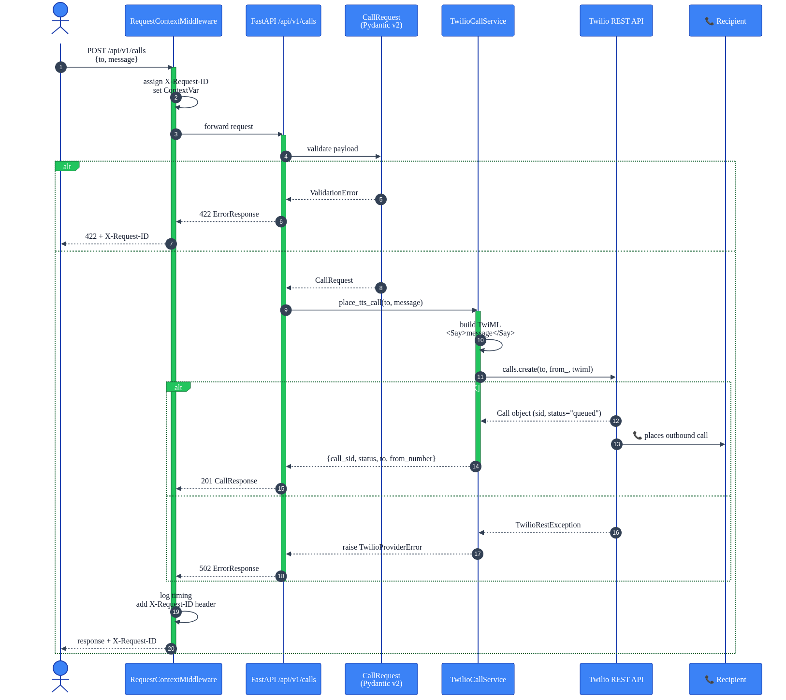
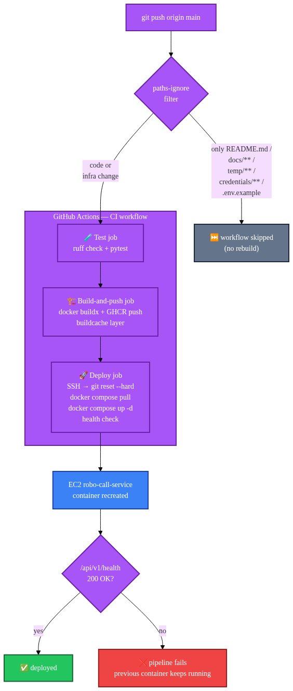
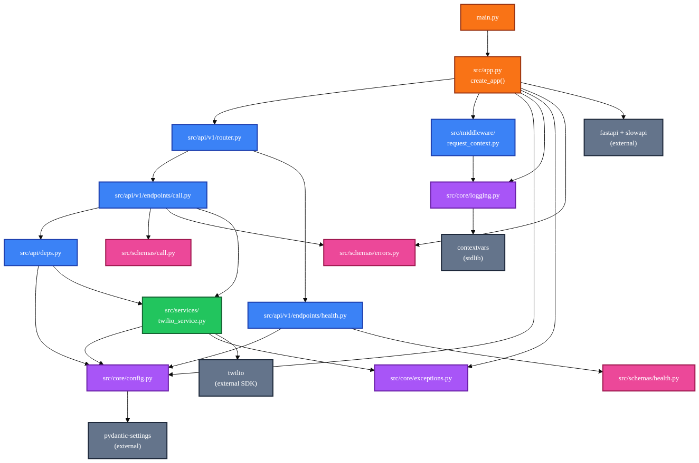
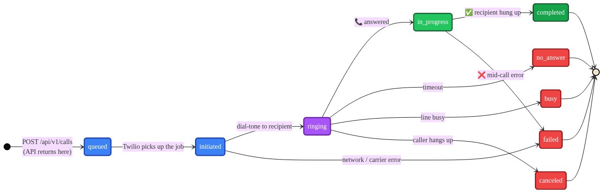

# Robo Call Microservice

A production FastAPI microservice that places outbound voice calls via **Twilio** and reads a supplied message to the recipient using text-to-speech. Runs as a Docker container on EC2, deployed from GitHub via a CI/CD pipeline that builds images to GHCR and rolls them out over SSH.

---

## Overview

One endpoint, one job: accept `{to, message}`, place a call, return the Twilio call SID. The service is internal — it binds to loopback on the EC2 host so only sibling containers and host processes can reach it. Outbound traffic to Twilio is allowed; inbound traffic from the public internet is not.

| | |
|---|---|
| **Language** | Python 3.12 |
| **Framework** | FastAPI (Pydantic v2) + uvicorn |
| **External APIs** | Twilio Voice (Programmable Voice) |
| **Deploy target** | Single EC2 host, Docker Compose |
| **Image registry** | GitHub Container Registry (GHCR) |
| **CI/CD** | GitHub Actions (test → build → deploy) |

---

## Architecture

How the pieces fit together — from `git push` all the way to a ringing phone.



- **GitHub** hosts the source and runs the CI workflow.
- **GHCR** stores built images; the EC2 host pulls from it.
- **EC2** runs Docker containers on a single box. Our service (`robo-call-service`) binds to `127.0.0.1:8013` — **not** `0.0.0.0` — so the public internet can't reach it.
- **Internal callers** (other containers or host processes on the same EC2) hit `http://host.docker.internal:8013/api/v1/calls` or `http://127.0.0.1:8013/...` from the host.
- The service's only outbound dependency is **Twilio**, which does the actual dialing.

---

## Request flow

What happens when a caller sends `POST /api/v1/calls`.



1. `RequestContextMiddleware` assigns an `X-Request-ID` and stores it in a `ContextVar` so every log line inside this request is tagged with it.
2. Pydantic validates `CallRequest` at the edge — rejects bad E.164 numbers (`422` with a structured `ErrorResponse` envelope containing the request ID).
3. The router resolves `TwilioCallService` via `Depends` (mockable in tests).
4. The service builds TwiML (`<Response><Say>{message}</Say></Response>`) and calls `client.calls.create(...)`.
5. Twilio queues the call and starts dialing; the API returns `201` with the call SID.
6. On Twilio errors, `TwilioRestException` is mapped to `TwilioProviderError` → `502` with the same error envelope.

---

## CI/CD pipeline



Every push to `main` runs the workflow in [.github/workflows/ci.yml](.github/workflows/ci.yml):

1. **`paths-ignore` filter** — changes touching only docs, README, `temp/`, `credentials/`, `.env.example`, `.gitignore`, `.dockerignore`, `docs/**`, or `.python-version` **skip the entire workflow**. No rebuilds for documentation edits.
2. **Test job** — `ruff check` + `pytest`. Dependencies installed from `pyproject.toml` extras.
3. **Build-and-push job** (only on `main`) — `docker buildx` with GHCR build cache, pushes `ghcr.io/ansimran/microservice-robo-call/robo-call-service:latest`.
4. **Deploy job** — SSHes to the EC2 host using `DEPLOY_SSH_KEY`, runs `git fetch && reset --hard origin/main`, `docker compose pull`, `docker compose up -d --remove-orphans`, then curls `/api/v1/health` to confirm the rollout.

Required repo secrets: `DEPLOY_HOST`, `DEPLOY_USER`, `DEPLOY_GIT_PATH`, `DEPLOY_SSH_KEY`, `GHCR_USER`, `GHCR_TOKEN`.

---

## Module dependencies

Internal package structure — what imports what.



- `src/app.py` is the application factory (`create_app()`) — wires middleware, exception handlers, routers, and the slowapi limiter.
- `src/api/v1/` holds the HTTP layer: `endpoints/call.py` and `endpoints/health.py`, aggregated by `router.py`.
- `src/services/twilio_service.py` is the only module that talks to Twilio. Everything above it is mockable via `app.dependency_overrides[get_twilio_service]`.
- `src/core/` holds cross-cutting concerns: `config.py` (typed `Settings`), `logging.py` (request-id context var), `exceptions.py` (error hierarchy).
- `src/schemas/` is the Pydantic contract — `CallRequest`/`CallResponse`/`HealthResponse`/`ErrorResponse`, all with `Field(..., description=..., examples=...)`.

---

## Call lifecycle

Twilio walks a call through the following states. The API only sees `queued` at creation time — the rest happens inside Twilio.



| State | Meaning |
|---|---|
| `queued` | Accepted by Twilio, waiting for a trunk |
| `initiated` | Twilio is about to dial |
| `ringing` | Recipient's phone is ringing |
| `in-progress` | Recipient answered, TTS is playing |
| `completed` | Call ended normally |
| `no-answer` | Rang out without being picked up |
| `busy` | Line was busy |
| `canceled` | Caller hung up before the call connected |
| `failed` | Network or carrier error |

To observe post-queue states, configure a status-callback webhook on the Twilio side (not yet wired).

---

## API reference

| Method | Path | Description |
|---|---|---|
| `GET` | `/api/v1/health` | Liveness probe. Returns service metadata. |
| `POST` | `/api/v1/calls` | Place a TTS robo-call. |

### `POST /api/v1/calls`

**Request**
```json
{
  "to": "+19494248180",
  "message": "Hello! This is a reminder about your appointment tomorrow."
}
```

**Response** (`201 Created`)
```json
{
  "call_sid": "CAf9f1e93fdd78dad37f1ff1c40026d94a",
  "status": "queued",
  "to": "+19494248180",
  "from_number": "+18339213517"
}
```

**Errors**

| Code | When | Body |
|---|---|---|
| `422` | Invalid phone or empty/too-long message | `ErrorResponse{error, detail, request_id}` |
| `429` | Rate limit exceeded (`RATE_LIMIT_PER_MINUTE`) | rate-limit envelope |
| `502` | Twilio rejected the call | `ErrorResponse{error, detail, request_id}` |

### curl (Windows `cmd.exe`)
```cmd
curl -X POST http://localhost:8000/api/v1/calls -H "Content-Type: application/json" -d "{\"to\":\"+19494248180\",\"message\":\"Hello from the robo call service\"}"
```

### curl (bash / macOS / Linux)
```bash
curl -X POST http://localhost:8000/api/v1/calls \
  -H "Content-Type: application/json" \
  -d '{"to":"+19494248180","message":"Hello from the robo call service"}'
```

On the EC2 host the service listens on `127.0.0.1:8013` — swap the port accordingly.

Interactive Swagger UI is at **`/docs`**.

---

## Configuration

Environment variables are loaded via `pydantic-settings` from a `.env` file or real environment.

| Variable | Required | Default | Description |
|---|---|---|---|
| `TWILIO_ACCOUNT_SID` | ✅ | — | Twilio Account SID (starts with `AC`). |
| `TWILIO_AUTH_TOKEN` | ✅ | — | Twilio Auth Token. |
| `TWILIO_FROM_NUMBER` | ✅ | — | Twilio caller ID in E.164 format. |
| `APP_ENV` | — | `development` | `development` / `staging` / `production`. |
| `LOG_LEVEL` | — | `INFO` | Python log level. |
| `HOST` | — | `0.0.0.0` | Uvicorn bind host (container side). |
| `PORT` | — | `8000` | Uvicorn bind port (container side). |
| `CORS_ORIGINS` | — | `["*"]` | Allowed CORS origins (JSON list). |
| `RATE_LIMIT_PER_MINUTE` | — | `30` | Per-IP requests-per-minute cap. |

---

## Local development

```bash
cp .env.example .env            # fill in your Twilio credentials
pip install -e ".[dev]"         # runtime + dev extras (ruff, pytest, mypy)
make run                        # or: python main.py
make test                       # pytest (Twilio is mocked — no real calls)
make lint                       # ruff check
make format                     # ruff format
```

Then open [http://localhost:8000/docs](http://localhost:8000/docs).

Tests use `app.dependency_overrides[get_twilio_service]` to swap in a `MagicMock`, so running tests never hits the real Twilio API.

---

## Docker / deployment

### Local Docker
```bash
docker compose up -d
docker compose logs -f
```

The compose file binds `127.0.0.1:8013 → container:8000` so locally the service is reachable at `http://127.0.0.1:8013`.

### Production (EC2)
Deployment is fully automated through the CI workflow — no manual steps on the server once the repo secrets are in place. The first-time bootstrap (only needed once per server):
```bash
# on the EC2 host
git clone https://github.com/AnsImran/robo-call-microservice.git ~/microservice-robo-call
cd ~/microservice-robo-call
# copy your .env into this directory
echo "$GHCR_TOKEN" | docker login ghcr.io -u "$GHCR_USER" --password-stdin
docker compose pull && docker compose up -d
```
After that, every `git push origin main` with code changes triggers the pipeline and the running container is replaced with the new image.

---

## Rendering the diagrams

The `.mmd` source files live in [`docs/diagrams/`](docs/diagrams/). To regenerate the PNGs:

```bash
make diagrams
# or directly:
python scripts/render_diagrams.py
```

The script uses the [mermaid.ink](https://mermaid.ink) public API, so **no Node.js or mermaid-cli install is needed** — only Python and an internet connection. Output PNGs land next to each `.mmd` file and are committed to the repo so GitHub can render them in this README without readers needing to build anything.

---

## Security notes

- **Loopback-only bind**: `ports: "127.0.0.1:8013:8000"` — even if the EC2 security group opens port 8013, Docker will refuse to map it to `0.0.0.0`. The service is invisible from the public internet.
- **Trial Twilio account**: can only call pre-verified numbers. Upgrade the Twilio account to reach arbitrary recipients.
- **No authentication (yet)**: anyone with network access to the loopback port can place calls. Acceptable for an internal-only service behind the host firewall; planned next step is `X-API-Key` header auth with keys stored in `.env`.
- **Secrets** are never baked into the image — they come from `.env` at runtime via `docker compose`'s `env_file`.

---

## Project layout

```
.
├── main.py                       # uvicorn entrypoint
├── pyproject.toml                # deps + ruff/pytest/mypy config
├── Dockerfile
├── docker-compose.yml            # loopback-only port binding
├── Makefile                      # install/run/test/lint/diagrams/docker
├── .env.example
├── .github/workflows/ci.yml      # test → build → deploy pipeline
├── src/
│   ├── app.py                    # create_app(), lifespan, middleware, handlers
│   ├── core/                     # config, logging, exceptions
│   ├── middleware/               # RequestContextMiddleware
│   ├── schemas/                  # Pydantic v2 models
│   ├── services/                 # TwilioCallService
│   └── api/v1/                   # versioned HTTP endpoints
├── tests/                        # pytest + TestClient + mocked Twilio
├── scripts/
│   └── render_diagrams.py        # .mmd → .png via mermaid.ink
└── docs/
    └── diagrams/                 # .mmd sources + rendered .png images
```
